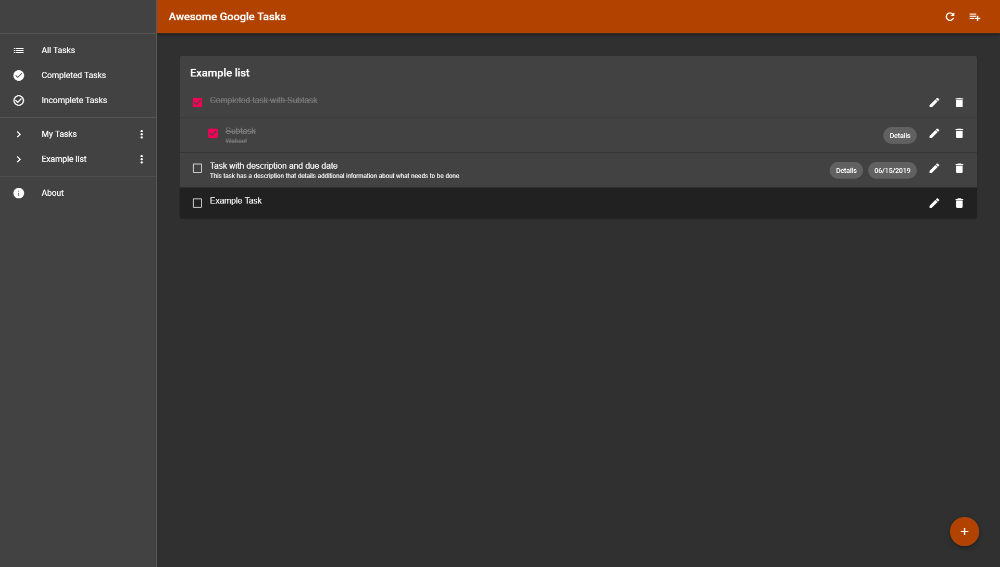

## Awesome Google Tasks
Alternative Web UI for Google Tasks made with React

<a href="https://awesomegoogletasks.com">Check it out</a>

### What's different in this Fork?
- Added automatic and manual refreshing
- Added support for viewing subtasks
- Added descriptions on the main view
- Changed About modal
- Changed a couple shortcuts that were intercepted by the browser
- Changed everything to be dark themed
- Fixed some cases where the tasks would be sorted incorrectly
- Fixed the app failing to save changes if too many changes are made at once
- Made the app stretch to fill all available vertical space

  

### Why?
Because Google Tasks is awesome.

### What?
Awesome Google Tasks is a web client for Google Tasks. We use Google's public API to query and modify your tasks, so that anything you see in the mobile app and the original website is available through Awesome Google Tasks, and vice-versa.
This project does not have a server side, we do nothing with your data but sending it back and forward from Google to your browser, it's important to me to clarify that this is just a client app.

You can use Awesome Google Tasks to do almost anything you can do with the original client, with the exception of reording tasks, creating sub-tasks and moving tasks between lists.
These features are planned to be implemented in the future. 
If you find any other differences between Awesome Google Tasks to the official clients, please [create an issue](https://github.com/bluzi/awesome-google-tasks/issues).

### How?
Awesome Google Tasks is implemented using React and [bluzi/google-tasks-api](https://github.com/bluzi/google-tasks-api).
You can use [bluzi/google-tasks-api](https://github.com/bluzi/google-tasks-api) to create your own client, or to create other services that integrate with Google Tasks.
I've tried to make it easier to communicate with Google Tasks API, as I found it pretty over-complicated.
Feel free to browse the code and ask questions by [creating issues](https://github.com/bluzi/awesome-google-tasks/issues) or by mail (info@awesomegoogletasks.com), one aspect of this repository is to be a sample app for such integrations. 

### Awesome Features
#### Keyboard Shortcuts
The following shortcuts are available: 
- Use up/down arrows to navigate between tasks/lists
- Use `CTRL + left/right` arrows to navigate between the tasks and the lists panel
- Press Enter when selecting a list to navigate into it
- Press Enter when selecting a task to create a new task
- Use `CTRL + Enter` when selecting a task to mark it as completed
- Use `CTRL + N` to create new tasks or lists
- Use `CTRL + Q` to edit a task or a list
- Use `CTRL + D` to delete a task or a list
- Use `CTRL + A` to navigate to All Tasks view

Feel free to suggest more shortcuts or changes to existing shortcuts. :) 

### Contributions
Please feel free to ask for features by [creating issues](https://github.com/bluzi/awesome-google-tasks/issues), or to implement features by [creating pull requests](https://github.com/bluzi/awesome-google-tasks/pulls).
I'll do my best to review things as fast as I can, as I always try to do.

If you find any errors or strange behaviors, please report them by [creating an issue](https://github.com/bluzi/awesome-google-tasks/issues).

### License
This project is licensed under the MIT License.
